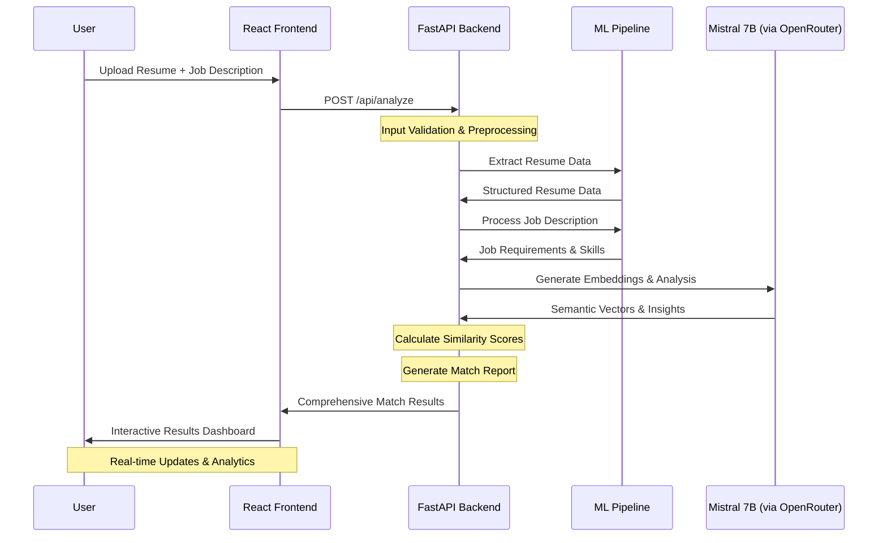

# 🎯 ResuMatch

<div align="center">
  
  
  
  
  
</div>

<div align="center">
  <h3>🚀 Intelligent Resume-Job Matching System</h3>
  <p>A full-stack GenAI application that uses advanced LLMs and semantic similarity to intelligently match resumes with job descriptions</p>
</div>

---

## 📋 Table of Contents

- [Overview](#-overview)
- [Key Features](#-key-features)
- [Tech Stack](#-tech-stack)
- [Architecture](#-architecture)
- [Installation](#-installation)
- [Usage](#-usage)
- [API Endpoints](#-api-endpoints)
- [Screenshots](#-screenshots)
- [Contributing](#-contributing)
- [License](#-license)

## 🌟 Overview

**ResuMatch** is an intelligent resume parsing and job matching system that leverages the power of **Mistral 7B** LLM through OpenRouter APIs to provide accurate, context-aware matching between resumes and job descriptions. The system combines advanced NLP techniques with semantic similarity algorithms to deliver precise matching scores and detailed insights.

### 🎯 Problem Statement
Traditional resume screening processes are time-consuming and often miss qualified candidates due to keyword-based filtering. ResuMatch solves this by understanding the semantic meaning and context of both resumes and job requirements.

### 💡 Solution
- **AI-Powered Analysis**: Uses Mistral 7B for deep understanding of resume content and job requirements
- **Semantic Matching**: Implements cosine similarity for accurate matching beyond simple keyword matching
- **Real-time Processing**: Fast PDF parsing and instant matching results
- **Intuitive Interface**: Clean, responsive React frontend for seamless user experience

## ✨ Key Features

### 🔍 **Smart Resume Parsing**
- Extract structured information from PDF resumes
- Support for various resume formats and layouts
- Advanced text preprocessing and cleaning
- Skills, experience, and education extraction

### 🎯 **Intelligent Job Matching**
- Semantic analysis of job descriptions
- Context-aware matching using LLMs
- Detailed matching breakdown by categories
- Percentage-based scoring system

### 📊 **Advanced Analytics**
- Cosine similarity calculations
- Category-wise match analysis
- Missing skills identification
- Improvement recommendations

### 🚀 **Modern Tech Stack**
- **Frontend**: React with modern UI components
- **Backend**: FastAPI for high-performance API
- **AI**: Mistral 7B via OpenRouter for intelligent processing
- **Deployment**: Vercel (Frontend) + Render (Backend)

## 🛠️ Tech Stack

### Backend
-  **Python 3.8+**
-  **FastAPI** - High-performance web framework
-  **OpenRouter API** - LLM access layer
- **Mistral 7B** - Large Language Model for text analysis
- **PyPDF2/pdfplumber** - PDF parsing and text extraction
- **scikit-learn** - Cosine similarity calculations
- **NLTK/spaCy** - Natural language processing

### Frontend
-  **React 18+**
-  **JavaScript (ES6+)**
-  **Tailwind CSS** - Styling
- **Axios** - HTTP client for API calls
- **React Router** - Navigation
- **React Dropzone** - File upload handling

### Deployment
-  **Netlify** - Frontend deployment
-  **Render** - Backend deployment

## 🏗️ System Architecture

### Sequence Diagram




## 🚀 Installation

### Prerequisites
- Python 3.8+
- Node.js 16+
- OpenRouter API Key

### Backend Setup

1. **Clone the repository**
   ```bash
   git clone https://github.com/cherypallysaisurya/ResuMatch.git
   cd ResuMatch
   ```

2. **Set up Python environment**
   ```bash
   cd backend
   python -m venv venv
   source venv/bin/activate  # On Windows: venv\Scripts\activate
   pip install -r requirements.txt
   ```

3. **Environment Configuration**
   ```bash
   cp .env.example .env
   # Edit .env with your configuration
   ```
   
   Required environment variables:
   ```env
   OPENROUTER_API_KEY=your_openrouter_api_key
   OPENROUTER_API_URL=https://openrouter.ai/api/v1/chat/completions
   MODEL_NAME=mistralai/mistral-7b-instruct
   CORS_ORIGINS=["http://localhost:3000"]
   ```

4. **Run the backend server**
   ```bash
   uvicorn main:app --reload --host 0.0.0.0 --port 8000
   ```

### Frontend Setup

1. **Navigate to frontend directory**
   ```bash
   cd ../frontend
   ```

2. **Install dependencies**
   ```bash
   npm install
   ```

3. **Environment Configuration**
   ```bash
   cp .env.example .env.local
   ```
   
   ```env
   REACT_APP_API_URL=http://localhost:8000
   ```

4. **Start the development server**
   ```bash
   npm start
   ```

The application will be available at:
- Frontend: `http://localhost:3000`
- Backend API: `http://localhost:8000`
- API Documentation: `http://localhost:8000/docs`

## 📱 Usage

### 1. **Upload Resume**
- Drag and drop or click to upload PDF resume
- System automatically extracts and processes content
- View parsed information in structured format

### 2. **Input Job Description**
- Paste or type the target job description
- System analyzes requirements and key skills
- Automatically categorizes job requirements

### 3. **Get Matching Results**
- AI-powered analysis provides detailed matching score
- View category-wise breakdown (Skills, Experience, Education)
- Get recommendations for profile improvement

### 4. **Analyze Results**
- Detailed similarity metrics
- Missing skills identification
- Improvement suggestions
- Export results for future reference

## 🔌 API Endpoints

### Resume Processing
```http
POST /api/parse-resume
Content-Type: multipart/form-data

# Upload resume file
# Returns: Parsed resume data
```

### Job Matching
```http
POST /api/match-job
Content-Type: application/json

{
  "resume_text": "parsed resume content",
  "job_description": "target job description"
}

# Returns: Matching score and detailed analysis
```

### Health Check
```http
GET /api/health
# Returns: API status and version info
```

## 📊 Expected Outputs & Results

### 1. **Resume Analysis Output**
```json
{
  "resume_analysis": {
    "personal_info": {
      "name": "John Doe",
      "email": "john.doe@email.com",
      "phone": "+1-234-567-8900",
      "location": "San Francisco, CA"
    },
    "experience": {
      "total_years": 5.2,
      "relevant_years": 3.8,
      "positions": [
        {
          "title": "Senior Software Engineer",
          "company": "Tech Corp",
          "duration": "2021-2024",
          "key_achievements": [
            "Led team of 5 developers",
            "Improved system performance by 40%",
            "Implemented microservices architecture"
          ]
        }
      ]
    },
    "skills": {
      "technical": ["Python", "React", "AWS", "Docker", "PostgreSQL"],
      "soft_skills": ["Leadership", "Problem Solving", "Communication"],
      "certifications": ["AWS Solutions Architect", "Scrum Master"]
    },
    "education": {
      "highest_degree": "Master's in Computer Science",
      "institution": "Stanford University",
      "graduation_year": 2019,
      "gpa": 3.8
    }
  }
}
```

### 2. **Job Matching Results**
```json
{
  "match_results": {
    "overall_score": 87.5,
    "confidence_level": "High",
    "recommendation": "Excellent match - Proceed with application",
    
    "category_scores": {
      "technical_skills": {
        "score": 92,
        "matched_skills": ["Python", "React", "AWS", "Docker"],
        "missing_skills": ["Kubernetes", "GraphQL"],
        "skill_gaps": [
          {
            "skill": "Kubernetes",
            "importance": "High",
            "learning_resources": ["Official K8s Documentation", "Cloud Native Courses"]
          }
        ]
      },
      "experience": {
        "score": 85,
        "required_years": 3,
        "candidate_years": 5.2,
        "relevant_experience": "Strong background in full-stack development",
        "experience_match": "Exceeds requirements"
      },
      "education": {
        "score": 90,
        "requirement_met": true,
        "degree_relevance": "Highly relevant",
        "additional_qualifications": ["Advanced coursework in ML/AI"]
      },
      "soft_skills": {
        "score": 82,
        "matched_skills": ["Leadership", "Communication"],
        "assessment": "Well-aligned with team collaboration requirements"
      }
    },
    
    "detailed_analysis": {
      "strengths": [
        "Strong technical foundation with 5+ years experience",
        "Leadership experience managing development teams",
        "Relevant cloud architecture experience",
        "Proven track record of performance improvements"
      ],
      "areas_for_improvement": [
        "Consider gaining Kubernetes certification",
        "Explore GraphQL for modern API development",
        "Enhance DevOps pipeline knowledge"
      ],
      "interview_talking_points": [
        "Discuss microservices architecture implementation",
        "Share team leadership experiences",
        "Explain performance optimization strategies"
      ]
    }
  }
}
```

### 3. **Similarity Analysis**
```json
{
  "similarity_metrics": {
    "semantic_similarity": 0.847,
    "keyword_overlap": 0.792,
    "context_relevance": 0.901,
    "skill_alignment": 0.885,
    
    "embedding_analysis": {
      "resume_vector_strength": 0.934,
      "job_vector_strength": 0.912,
      "cosine_similarity": 0.847,
      "euclidean_distance": 0.621
    },
    
    "nlp_insights": {
      "key_phrases_matched": [
        "software development lifecycle",
        "agile methodologies",
        "cloud architecture",
        "team leadership"
      ],
      "sentiment_analysis": {
        "resume_tone": "Professional, Achievement-focused",
        "job_description_tone": "Collaborative, Innovation-driven",
        "cultural_fit": 0.78
      }
    }
  }
}
```

### 4. **Recommendations Engine Output**
```json
{
  "recommendations": {
    "application_strategy": {
      "priority": "High Priority Application",
      "timeline": "Apply within 48 hours",
      "success_probability": 0.85,
      
      "cover_letter_tips": [
        "Emphasize your microservices architecture experience",
        "Highlight team leadership and mentoring achievements",
        "Connect your performance optimization wins to their scale challenges"
      ],
      
      "interview_preparation": {
        "technical_focus_areas": [
          "System design and scalability",
          "Cloud architecture patterns",
          "Team management and mentoring"
        ],
        "potential_questions": [
          "How did you achieve 40% performance improvement?",
          "Describe your experience with microservices migration",
          "How do you handle technical debt in legacy systems?"
        ]
      }
    },
    
    "skill_development": {
      "immediate_actions": [
        {
          "skill": "Kubernetes",
          "urgency": "High",
          "estimated_time": "2-3 weeks",
          "resources": [
            "Kubernetes in Action (Book)",
            "CNCF Kubernetes Course",
            "Hands-on EKS Workshop"
          ]
        }
      ],
      "long_term_goals": [
        "DevOps certification pathway",
        "Advanced cloud architecture specialization",
        "Technical leadership program"
      ]
    }
  }
}
```

### 5. **Visual Analytics Dashboard**
```json
{
  "dashboard_metrics": {
    "match_breakdown": {
      "labels": ["Technical Skills", "Experience", "Education", "Soft Skills"],
      "scores": [92, 85, 90, 82],
      "colors": ["#4CAF50", "#2196F3", "#FF9800", "#9C27B0"]
    },
    
    "skill_radar_chart": {
      "axes": ["Programming", "Cloud", "Leadership", "Architecture", "DevOps"],
      "candidate_scores": [95, 88, 85, 90, 72],
      "job_requirements": [90, 85, 80, 88, 85]
    },
    
    "timeline_projection": {
      "readiness_timeline": "Ready to apply now",
      "skill_gap_closure": "2-4 weeks with focused learning",
      "optimal_application_window": "Next 1-2 weeks"
    }
  }
}
```

## 🧪 Testing

### Run Backend Tests
```bash
cd backend
pytest tests/ -v
```

### Run Frontend Tests
```bash
cd frontend
npm test
```

## 🚀 Deployment

### Backend (Render)
1. Connect your GitHub repository to Render
2. Set environment variables in Render dashboard
3. Deploy with automatic builds on push

### Frontend (Netlify)
1. Connect repository to Netlify
2. Set environment variables in Netlify dashboard:
   ```env
   REACT_APP_API_URL=your_backend_url
   REACT_APP_VERSION=1.0.0
   ```
3. Configure build settings:
   ```json
   {
     "build": {
       "command": "npm run build",
       "publish": "build"
     },
     "redirects": [
       {
         "from": "/*",
         "to": "/index.html",
         "status": 200
       }
     ]
   }
   ```

## 🤝 Contributing

We welcome contributions! Please follow these steps:

1. **Fork the repository**
2. **Create a feature branch** (`git checkout -b feature/AmazingFeature`)
3. **Commit your changes** (`git commit -m 'Add some AmazingFeature'`)
4. **Push to the branch** (`git push origin feature/AmazingFeature`)
5. **Open a Pull Request**

### Development Guidelines
- Follow PEP 8 for Python code
- Use ESLint and Prettier for JavaScript
- Write tests for new features
- Update documentation as needed

## 📄 License

This project is licensed under the MIT License - see the [LICENSE](LICENSE) file for details.

## 👤 Author

**Saisurya Cherupally**
- GitHub: [@cherypallysaisurya](https://github.com/cherypallysaisurya)
- LinkedIn: [Saisurya](https://linkedin.com/in/Saisurya)
- Email: csaisurya@gmail.com

## 🙏 Acknowledgments

- [OpenRouter](https://openrouter.ai/) for providing access to Mistral 7B
- [Mistral AI](https://mistral.ai/) for the powerful language model
- [FastAPI](https://fastapi.tiangolo.com/) for the excellent web framework
- [React](https://reactjs.org/) for the frontend framework

## 📈 Roadmap

- [ ] Support for multiple resume formats (DOC, DOCX)
- [ ] Batch processing capabilities
- [ ] Advanced filtering and search
- [ ] Integration with job boards
- [ ] Mobile application
- [ ] Multi-language support

---

<div align="center">
  <p>⭐ Star this repository if you find it helpful!</p>
  <p>🔗 <a href="https://resumatcher.netlify.app/">Live Demo</a> | 📚 <a href="https://resumatch-api.render.com/docs">API Docs</a></p>
</div>
